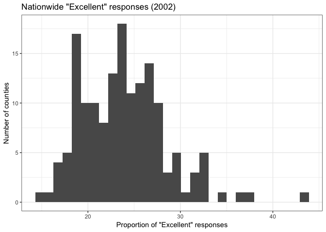
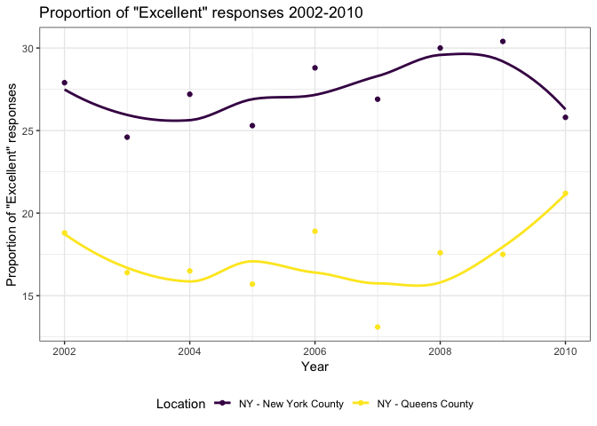

p8105\_hw2\_amv2187
================
Alyssa Vanderbeek
4 October 2018

Problem 1
---------

``` r
knitr::opts_chunk$set(echo = TRUE)

library(tidyverse)
```

    ## ── Attaching packages ──────────────────────────────────────── tidyverse 1.2.1 ──

    ## ✔ ggplot2 3.0.0     ✔ purrr   0.2.5
    ## ✔ tibble  1.4.2     ✔ dplyr   0.7.6
    ## ✔ tidyr   0.8.1     ✔ stringr 1.3.1
    ## ✔ readr   1.1.1     ✔ forcats 0.3.0

    ## ── Conflicts ─────────────────────────────────────────── tidyverse_conflicts() ──
    ## ✖ dplyr::filter() masks stats::filter()
    ## ✖ dplyr::lag()    masks stats::lag()

``` r
library(readxl)
library(p8105.datasets)
```

``` r
transit_data_clean = read_csv("data/NYC_Transit_Subway_Entrance_And_Exit_Data.csv") %>%
  janitor::clean_names() %>%
  select(line, station_name, station_latitude, station_longitude, route1:route11, entry, vending, entrance_type, ada) %>%
  mutate(entry = recode(entry, 'YES' = TRUE, 'NO' = FALSE))
```

    ## Parsed with column specification:
    ## cols(
    ##   .default = col_character(),
    ##   `Station Latitude` = col_double(),
    ##   `Station Longitude` = col_double(),
    ##   Route8 = col_integer(),
    ##   Route9 = col_integer(),
    ##   Route10 = col_integer(),
    ##   Route11 = col_integer(),
    ##   ADA = col_logical(),
    ##   `Free Crossover` = col_logical(),
    ##   `Entrance Latitude` = col_double(),
    ##   `Entrance Longitude` = col_double()
    ## )

    ## See spec(...) for full column specifications.

``` r
str(transit_data_clean) # display head of transit dataset
```

    ## Classes 'tbl_df', 'tbl' and 'data.frame':    1868 obs. of  19 variables:
    ##  $ line             : chr  "4 Avenue" "4 Avenue" "4 Avenue" "4 Avenue" ...
    ##  $ station_name     : chr  "25th St" "25th St" "36th St" "36th St" ...
    ##  $ station_latitude : num  40.7 40.7 40.7 40.7 40.7 ...
    ##  $ station_longitude: num  -74 -74 -74 -74 -74 ...
    ##  $ route1           : chr  "R" "R" "N" "N" ...
    ##  $ route2           : chr  NA NA "R" "R" ...
    ##  $ route3           : chr  NA NA NA NA ...
    ##  $ route4           : chr  NA NA NA NA ...
    ##  $ route5           : chr  NA NA NA NA ...
    ##  $ route6           : chr  NA NA NA NA ...
    ##  $ route7           : chr  NA NA NA NA ...
    ##  $ route8           : int  NA NA NA NA NA NA NA NA NA NA ...
    ##  $ route9           : int  NA NA NA NA NA NA NA NA NA NA ...
    ##  $ route10          : int  NA NA NA NA NA NA NA NA NA NA ...
    ##  $ route11          : int  NA NA NA NA NA NA NA NA NA NA ...
    ##  $ entry            : logi  TRUE TRUE TRUE TRUE TRUE TRUE ...
    ##  $ vending          : chr  "YES" "YES" "YES" "YES" ...
    ##  $ entrance_type    : chr  "Stair" "Stair" "Stair" "Stair" ...
    ##  $ ada              : logi  FALSE FALSE FALSE FALSE FALSE FALSE ...

The cleaned dataset contains information about subway stations: the station name, the line it runs, its latitude and longitudinal location, the routes it services, whether entry exists and of what kind (stairs vs. elevator), and whether the station is ADA compliant. To learn and clean the data, I first imported and standardized the column names. I looked at the list of columns to understand what variables are available. Then I examined the unique values in a few of the columns to get a sense of how many distinct values there were. Lastly, I checked whether or not there were any missing values in the "Route 1" column. This would determine whether there were any stations (row entries) that had no routes associated. This would have been redundant and I would filter these rows out of the dataset. None were found. After cleaning the data as instructed, the dataset dimension are 1868 rows by 19 columns. As of now, this dataset is not tidy.

``` r
# number of distinct stations, defined by both station name and line
n_distinct_stations = transit_data_clean %>%
  distinct(station_name, line) %>%
  nrow

# number of ADA compliant stations
n_ada_compliant_stations = transit_data_clean %>%
  distinct(station_name, line, ada) %>%
  filter(ada == TRUE) %>%
  nrow

# proportion of stations entrances/exits without vending allow entrance
prop_no_vending_yes_entrance = transit_data_clean %>%
  filter(vending == 'NO') %>%
  summarise(sum(entry) / nrow(.))
```

There are 465 distinct stations, of which 84 are ADA compliant. Of the stations that do not have vending, 38% allow entrance.

``` r
# create tidy dataset
transit_data_tidy = transit_data_clean %>%
  gather(key = 'route', value = 'train', route1:route11) %>%
  mutate(route = substr(route, 6, nchar(route))) %>%
  distinct %>%
  filter(!is.na(train))

str(transit_data_tidy)
```

    ## Classes 'tbl_df', 'tbl' and 'data.frame':    1559 obs. of  10 variables:
    ##  $ line             : chr  "4 Avenue" "4 Avenue" "4 Avenue" "4 Avenue" ...
    ##  $ station_name     : chr  "25th St" "36th St" "45th St" "53rd St" ...
    ##  $ station_latitude : num  40.7 40.7 40.6 40.6 40.6 ...
    ##  $ station_longitude: num  -74 -74 -74 -74 -74 ...
    ##  $ entry            : logi  TRUE TRUE TRUE TRUE FALSE TRUE ...
    ##  $ vending          : chr  "YES" "YES" "YES" "YES" ...
    ##  $ entrance_type    : chr  "Stair" "Stair" "Stair" "Stair" ...
    ##  $ ada              : logi  FALSE FALSE FALSE FALSE FALSE FALSE ...
    ##  $ route            : chr  "1" "1" "1" "1" ...
    ##  $ train            : chr  "R" "N" "R" "R" ...

``` r
# number of stations that service the A train
A_train_station = transit_data_tidy %>%
  filter(train == 'A') %>%
  distinct %>%
  nrow

# number of stations that serive the A train and are ADA compliant
ADA_compliant_A_train = transit_data_tidy %>%
  filter(train == 'A', ada == TRUE) %>%
  distinct %>%  
  nrow
```

Additionally, 91 stations service the A train, of which 34 are ADA compliant.

Problem 2
---------

``` r
## Mr. Trash Wheel data
trash_wheel_data = read_excel("data/HealthyHarborWaterWheelTotals2017-9-26.xlsx", 
    sheet = "Mr. Trash Wheel", range = cell_cols(1:14)) %>%
  janitor::clean_names() %>%
  filter(!is.na(dumpster) & month %in% month.name) %>%  # only dumpster-specific rows; i.e. dumpster number specified and row values are not totals
  mutate(sports_balls = as.integer(round(sports_balls)))

str(trash_wheel_data) # display column names and type
```

    ## Classes 'tbl_df', 'tbl' and 'data.frame':    215 obs. of  14 variables:
    ##  $ dumpster          : num  1 2 3 4 5 6 7 8 9 10 ...
    ##  $ month             : chr  "May" "May" "May" "May" ...
    ##  $ year              : num  2014 2014 2014 2014 2014 ...
    ##  $ date              : POSIXct, format: "2014-05-16" "2014-05-16" ...
    ##  $ weight_tons       : num  4.31 2.74 3.45 3.1 4.06 2.71 1.91 3.7 2.52 3.76 ...
    ##  $ volume_cubic_yards: num  18 13 15 15 18 13 8 16 14 18 ...
    ##  $ plastic_bottles   : num  1450 1120 2450 2380 980 1430 910 3580 2400 1340 ...
    ##  $ polystyrene       : num  1820 1030 3100 2730 870 2140 1090 4310 2790 1730 ...
    ##  $ cigarette_butts   : num  126000 91000 105000 100000 120000 90000 56000 112000 98000 130000 ...
    ##  $ glass_bottles     : num  72 42 50 52 72 46 32 58 49 75 ...
    ##  $ grocery_bags      : num  584 496 1080 896 368 ...
    ##  $ chip_bags         : num  1162 874 2032 1971 753 ...
    ##  $ sports_balls      : int  7 5 6 6 7 5 3 6 6 7 ...
    ##  $ homes_powered     : num  0 0 0 0 0 0 0 0 0 0 ...

``` r
## Precipitation data
# 2016
precipitation_2016 = readxl::read_excel("data/HealthyHarborWaterWheelTotals2017-9-26.xlsx", 
    sheet = "2016 Precipitation", skip = 1) %>%
  janitor::clean_names() %>%
  filter(!is.na(month)) %>%
  mutate(year = '2016')

str(precipitation_2016)
```

    ## Classes 'tbl_df', 'tbl' and 'data.frame':    12 obs. of  3 variables:
    ##  $ month: num  1 2 3 4 5 6 7 8 9 10 ...
    ##  $ total: num  3.23 5.32 2.24 1.78 5.19 3.2 6.09 3.96 4.53 0.62 ...
    ##  $ year : chr  "2016" "2016" "2016" "2016" ...

``` r
# 2017
precipitation_2017 = readxl::read_excel("data/HealthyHarborWaterWheelTotals2017-9-26.xlsx", 
    sheet = "2017 Precipitation", skip = 1) %>%
  janitor::clean_names() %>%
  filter(!is.na(month) & !is.na(total)) %>%
  mutate(year = '2017')

str(precipitation_2017)
```

    ## Classes 'tbl_df', 'tbl' and 'data.frame':    8 obs. of  3 variables:
    ##  $ month: num  1 2 3 4 5 6 7 8
    ##  $ total: num  2.34 1.46 3.57 3.99 5.64 1.4 7.09 4.44
    ##  $ year : chr  "2017" "2017" "2017" "2017" ...

``` r
# Combined both years
precipitation_combined = bind_rows(precipitation_2016, precipitation_2017) %>%
  mutate(month = month.name[month]) # create month as character with labels January through December

str(precipitation_combined)
```

    ## Classes 'tbl_df', 'tbl' and 'data.frame':    20 obs. of  3 variables:
    ##  $ month: chr  "January" "February" "March" "April" ...
    ##  $ total: num  3.23 5.32 2.24 1.78 5.19 3.2 6.09 3.96 4.53 0.62 ...
    ##  $ year : chr  "2016" "2016" "2016" "2016" ...

The trash wheel dataset contains information about dumpsters that are sent to a waste-to-energy facility once they become full. In about 3 years, 215 were filled and transported to the facility. For each dumpster, information was collected regarding its weight, volume, and the type of waste it contained. This includes the number of glass bottles, plastic bags, and sports balls, to name a few. The number of homes that each dumpster powered is also estimated. For example, from this data we know that the median number of sports balls collected in 2016 was 26.

Notably, dumpsters are filled more frequently in periods of precipitation. The precipitation dataset contains the total rainfall (in inches) for each month in the years 2016 and 2017. The average rainfall in 2016 was 3.33 inches, with a high of 6.09 inches in July, and a low of 0.62 inches in October. In 2017, precipitation data was missing for September through December. The average rainfall was 3.74 inches, with a high of 7.09 inches in July, and a low of 1.4 inches in June. The total precipitation in 2017 (for January through August) was 29.93 inches.

Problem 3
---------

``` r
data("brfss_smart2010") 

brfss_cleaned = brfss_smart2010 %>%
  janitor::clean_names() %>%
  filter(topic == 'Overall Health') %>%
  select(-class, -topic, -question, -sample_size, -confidence_limit_low:-geo_location) %>%
  spread(key = response, value = data_value) %>%
  janitor::clean_names() %>%
  mutate(excellent_or_very_good = excellent + very_good)

str(brfss_cleaned)
```

    ## Classes 'tbl_df', 'tbl' and 'data.frame':    2125 obs. of  9 variables:
    ##  $ year                  : int  2002 2002 2002 2002 2002 2002 2002 2002 2002 2002 ...
    ##  $ locationabbr          : chr  "AK" "AL" "AR" "AZ" ...
    ##  $ locationdesc          : chr  "AK - Anchorage Municipality" "AL - Jefferson County" "AR - Pulaski County" "AZ - Maricopa County" ...
    ##  $ excellent             : num  27.9 18.5 24.1 21.6 26.6 22.7 21.2 25.5 22.2 23.4 ...
    ##  $ fair                  : num  8.6 12.1 12.5 10.3 7.5 14.3 14.4 8 11.1 11.4 ...
    ##  $ good                  : num  23.8 32.7 29.9 26.9 31.9 28.7 29 29.3 36.6 26.3 ...
    ##  $ poor                  : num  5.9 5.9 4.2 4.6 3.9 4.5 4.2 2.1 3 2.4 ...
    ##  $ very_good             : num  33.7 30.9 29.3 36.6 30.1 29.8 31.2 35.2 27.1 36.6 ...
    ##  $ excellent_or_very_good: num  61.6 49.4 53.4 58.2 56.7 52.5 52.4 60.7 49.3 60 ...

``` r
num_unique_locations = brfss_cleaned %>%
  distinct(locationdesc) %>%
  nrow

# which states are not included in the dataset?
missing_states = which(!(state.abb %in% unique(brfss_cleaned$locationabbr)))

## Function to get the mode(s) of a given variables (column)
Modes <- function(x) {
  t = which(table(x) == max(table(x)))
  return(paste(names(t), collapse = ','))
}

most_common_state = Modes(brfss_cleaned$locationabbr)
```

404 distinct locations were surveyed in the BRFSS data, and every state including Washington, DC is represented. New Jersey was observed most frequently.

In 2002, the median proportion "Excellent" responses was 23.6.

``` r
# Histogram of "Excellent" responses in 2002
brfss_cleaned %>%
  filter(year == 2002) %>%
  ggplot(., aes(x = excellent)) +
  geom_histogram() +
  labs(
    title = 'Nationwide "Excellent" responses (2002)',
    y = 'Number of counties',
    x = 'Proportion of "Excellent" responses'
  ) +
  theme_bw()
```

    ## `stat_bin()` using `bins = 30`. Pick better value with `binwidth`.

    ## Warning: Removed 2 rows containing non-finite values (stat_bin).



``` r
# Scatterplot of "Excellent" responses in New York and Queens counties 2002-2010
brfss_cleaned %>%
  filter(grepl('New York County|Queens County', locationdesc) == T) %>%
  ggplot(., aes(x = year, y = excellent, color = locationdesc)) +
  geom_point() +
  geom_smooth(method = 'loess', se = F) +
  labs(
    title = 'Proportion of "Excellent" responses 2002-2010',
    y = 'Proportion of "Excellent" responses',
    x = 'Year'
  ) +
  viridis::scale_color_viridis(
    name = "Location",
    discrete = TRUE
  ) +
  theme_bw() +
  theme(legend.position = "bottom")
```


